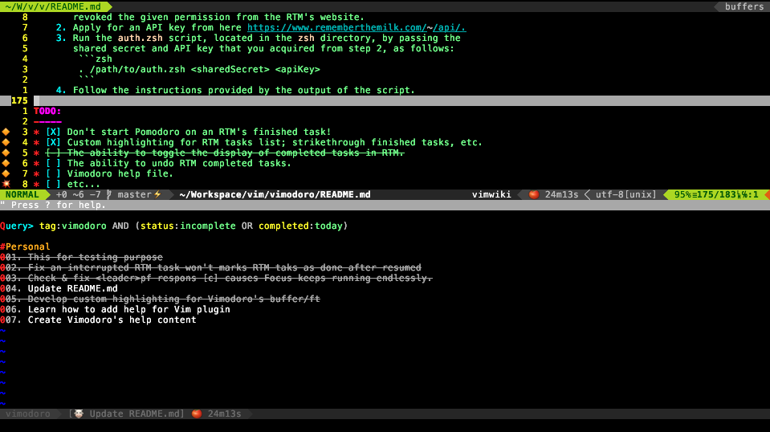
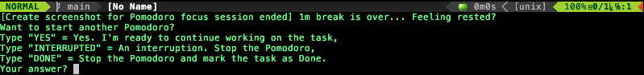

Vimodoro
========

Vimodoro is a [Vim](http://www.vim.org) plugin for the [Pomodoro time management technique](http://www.pomodorotechnique.com/).

This Vimodoro plugin originated from [adelarsq](https://github.com/adelarsq/vim-pomodoro), which in turn originated
from [mnick/vim-pomodoro](https://github.com/mnick/vim-pomodoro).

This is my first time working on a Vim plugin, so I forked mnick's Vim-Pomodoro
and added the modified version from Adelarsq's in order to keep track of the
complete changes history within this repository for learning purposes and to
show appreciation for their work.

Usage
-----
Currently, this version of Vimodoro is solely dependent on the [Vim-Airline](https://github.com/vim-airline/vim-airline)
plugin. Once this plugin installed, it will display current date and time in the
`g:airline_section_y` statusline.

Vimodoro can also be integrated with RTM (Remember The Milk), a task management
application. This integration allows users to select a task from RTM's task list
to be started in a Pomodoro focus session. Once the task is marked as completed
in the Pomodoro session, it will also be marked as completed in RTM. This
seamless integration between the two applications enhances productivity and task
management efficiency.

* `<leader>pt` -- Toggle between the default displayed information in the
  vim-airline's `g:airline_section_y` statusline and the Vimodoro's status
  information. If the Pomodoro has been running, then executing the toggle will
  display the file encoding within approximately two seconds, followed by the
  Pomodoro status being displayed again.
* `<leader>ps` -- Starts a new Pomodoro, a shortcut to `:PomodoroStart
  [pomodoro_name]`.
    After a Pomodoro has ended, a confirmation will remind you to take a break.
    When the break has ended, it will prompt you if you wish to start a new
    Pomodoro.
* `<leader>pm` -- Take a glimpse of the current date and time when the Pomodoro
  is running or when the `g:airline_section_y` is toggled to display the default
  airline's setting.
* `<leader>pf` -- Force stop on a running Pomodoro.
* `:RTM` -- Toggle to show/hide the "Remember The Milk's" tasks list split window.

Also, in addition to the default notifications inside vim, Vimodoro allows
you to add further external notifications, such as sounds, system-notification
popups etc.

Screenshots
-----------
The current time is displayed in the `g:airline_section_y` section if Pomodoro
has not activated yet, either started or break.


Started remaining time displayed in statusline


The RTM's split window



Break remaining time displayed in statusline


Pomodoro finished, let's take a break!


Take another turn?



Configuration
-------------
Add the following options to your `~/.vimrc` to configure Vimodoro, if desired.
No need to do so if you are satisfied with the default settings.

    " Vimodoro's status refresh rate in seconds. (default: 15)
    let g:pomodoro_status_refresh_duration = 1

    " Duration of a pomodoro in minutes (default: 25)
    let g:pomodoro_work_duration = 25

    " Duration of the short break in minutes (default: 5)
    let g:pomodoro_short_break = 5

    " Duration of the long break in minutes (default: 15)
    let g:pomodoro_long_break = 15

    " Path to the pomodoro log file (default: not defined)
    " Will write to log if file exists
    let g:pomodoro_log_file = "/tmp/pomodoro.log"

    " Path to the pomodoro debug log file (default: not defined)
    " Will write to debug log if file exists
    let g:pomodoro_debug_file = "/tmp/pomodoro.debug.log"

    " Pomodoro inactive icon (default: "🤖")
    let g:pomodoro_icon_inactive = '🤖'

    " Pomodoro focus session started icon (default: "🍅")
    let g:pomodoro_icon_started = "🍅"

    " Pomodoro focus session ended icot (default: "🌭")
    let g:pomodoro_icon_focus_ended = '🌭'

    " Pomodoro break session icon (default: "🍕")
    let g:pomodoro_icon_break = "🍕"

    " Pomodoro break session ended icon (default: "🍏")
    let g:pomodoro_icon_break_ended = '🍏'

    " Pomodoro status/time updates duration in second (default: 15)
    let g:pomodoro_status_refresh_duration = 15

    " Time format display on statusbar (default:'%{strftime("%a %b %d, %H:%M:%S")}')
    let g:pomodoro_time_format = '%{strftime("%a %b %d, %H:%M:%S")}'

    " Display time for n seconds then followed by Pomodoro status being displayed again,
    " or display file format for n milliseconds then back to display Pomodoro status. (default: 2)
    let g:pomodoro_redisplay_status_duration = 2


### Bells and Whistles
Notifications outside vim can be enabled through the option `g:pomodoro_notification_cmd`.
For instance, to play a soundfile after each completed pomodoro or break, add something like

    let g:pomodoro_notification_cmd = "mpg123 -q ~/.vim/pomodoro-notification.mp3"

to your `~/.vimrc`. System-wide notifications can, for instance, be done via zenity and
the option

    let g:pomodoro_notification_cmd = 'zenity --notification --text="Pomodoro finished"''

You can also use `g:pomodoro_work_end_notification_cmd` and `g:pomodoro_break_end_notification_cmd`
that will be executed exclusively when work is done and when a break is done.  For instance,
users on macOS can define the two variables like this:

    let g:pomodoro_work_end_notification_cmd = "say \"Let's take a break.\";
                \afplay $ICLOUDHOME/vim-pomodoro-audio/break.mp3&"
    let g:pomodoro_break_end_notification_cmd = "say \"Let's get back to work.\""

Note that in the above configuration example, the `$ICLOUDHOME` is simply a
custom environment variable that holds the full path to the iCloud drive.

The `g:pomodoro_notification_cmd` will be executed when either work or break
time has ended, provided the specific notification variable is not set.

Installation
------------
* vim: Use your favorite plugin manager such as pathogen.
* nvim: Using the lazy plugin manager.
    ```lua
    require("lazy").setup({
        -- your other plugin
        {"VimfanTPdvorak/vimodoro",
            dependencies = { "vim-airline/vim-airline" }
        }
    })
    ```
* RTM integration:
    * You should only run the following steps once, or whenever you have revoked
      the given permission from the RTM's website.
    * Apply for an API key from here https://www.rememberthemilk.com/services/api/.
    * Run the `auth.zsh` script, located in the `zsh` directory, by passing the
      shared secret and API key as follows:
        ```zsh
        . /path/to/auth.zsh <sharedSecret> <apiKey>
        ```
    * Follow the instructions provided by the output of the script.
